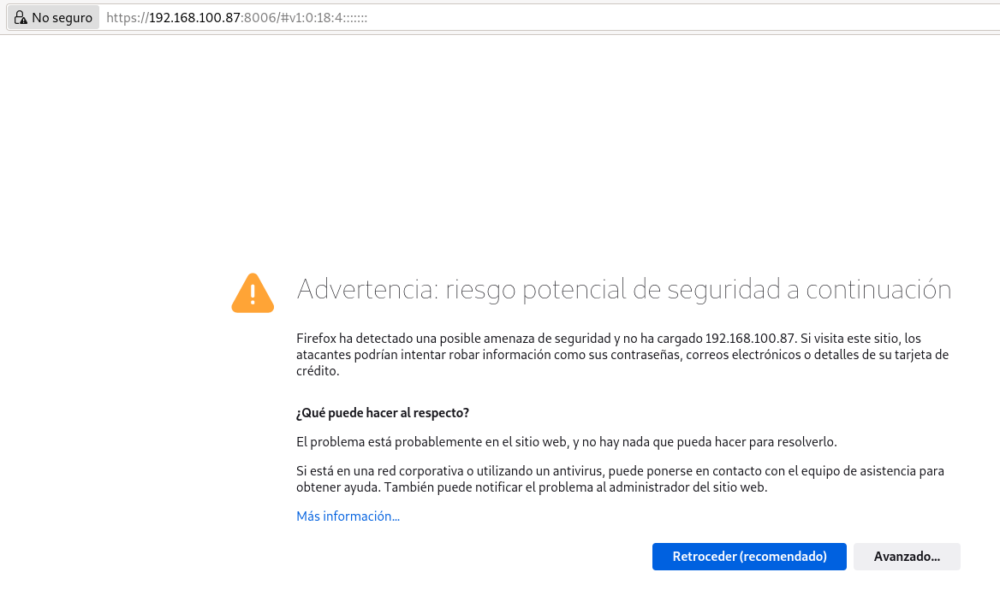
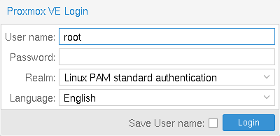

# Acceso a la GUI de Proxmox VE

Una vez instalado Proxmox VE en nuestro equipo, vamos a acceder a la
GUI (Interfaz Gráfica de Usuario), para ello vamos a utilizar un
navegador para acceder a la IP correspondiente de la máquina donde
hemos hecho la instalación, y que podemos ver al arrancar la máquina:

Aceptaremos excepcionalmente el certificado Accedemos a la URL que se
nos indica y nos encontramos:

Estamos accediendo con HTTPS y el certificado que está utilizando esta
firmado por una Autoridad Certificadora en la que nuestro navegador no
confía. Por lo tanto, y dependiendo del navegador, aceptaremos el
certificado para acceder a la aplicación. **Nota: Posteriormente y en
un entorno de producción podremos configurar nuestros propios
certificados para el acceso por HTTPS**.

Finalmente accederemos a la ventana de autentificación:

El usuario que indicamos es `root` y la contraseña la que hemos
indicado durante la instalación. El dominio (*Realm*) será *Linux PAM
standard authentication*, ya que el usuario `root` es un usuario del
sistema en Proxmox.
