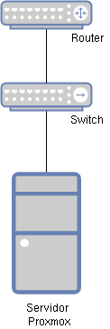
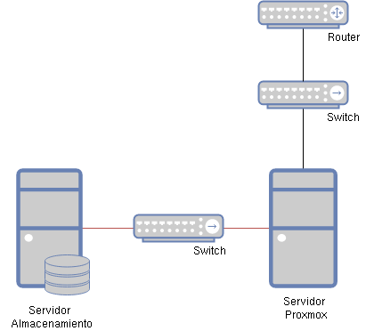
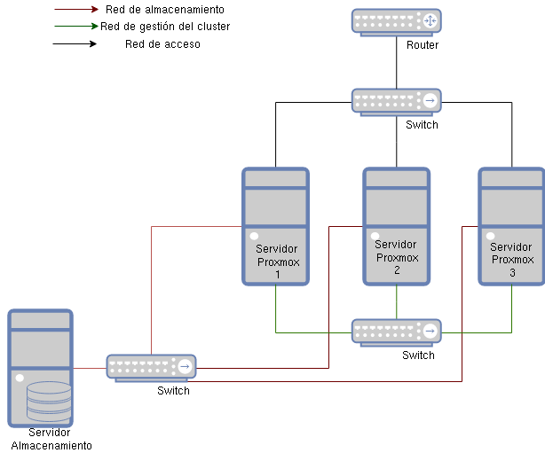

# Escenarios para la instalación de Proxmox VE

Antes de explicar la instalación de Proxmox VE vamos a estudiar los
posibles escenarios e infraestructura donde podemos instalar Proxmox
VE.

## Instalación de Proxmox VE en nuestro centro educativo

Si queremos utilizar Proxmox VE como herramienta de virtualización
para ofrecer recursos virtualizados a los alumnos de nuestros ciclos,
tendremos que utilizar máquinas físicas con recursos suficientes:

* CPU: No es crítico, las máquinas virtuales y contenedores utilizarán
  CPU virtuales para su ejecución. Una vCPU se puede entender como un hilo de ejecución, por lo que más cores tenga nuestra CPU física más potencia de computación podremos repartir entre los recursos virtualizados.
* RAM: Al crear una máquina virtual o un contenedor se irá reservando
  memoria RAM. Por lo tanto, dependiendo del tipo de sistema operativo
  que vayamos a instalar tendremos necesidades distintas.
* Almacenamiento: El almacenamiento que van a utilizar nuestras
  máquinas virtuales o contenedores podría ser proporcionado de
  distintas maneras:

    * **DAS (Direct-Attached Storage)**: Los dispositivos de
      almacenamiento están alojados en el propio servidor Proxmox VE.
    * **NAS (Network Attached Storage)**: En este caso tenemos un
      servidor de almacenamiento que nos permite compartir sistemas de
      ficheros (por ejemplo, NFS).
    * **SAN (Storage Area Network)**: En este caso, el servidor de
      almacenamiento nos permite compartir dispositivos de
      almacenamiento (de bloque) (por ejemplo, iSCSI).

Veamos a continuación dos posibles escenarios para la instalación de
Proxmox VE en nuestro centro educativo.

### Instalación de Proxmox VE en un solo nodo

Realmente Proxmox VE nos permite la construcción de un clúster de
servidores para la virtualización de recursos. En un centro educativo
puede ser una opción muy adecuada empezar a usar Proxmox con un solo
servidor. No tendríamos las características avanzadas que nos ofrece
el clúster (alta disponibilidad, migración de recursos, ...) pero
siempre podemos escalar nuestra infraestructura y crear un clúster
posteriormente. Tendríamos dos posibilidades:

**Un solo servidor Proxmox**

Utilizamos un servidor Proxmox VE conectado a la red de nuestro
departamento. Por defecto, las máquinas virtuales y contenedores
creados estarán conectadas a esta misma red, por lo que serán
accesibles sin problemas. En este caso se utilizará almacenamiento
DAS, es decir, el servidor tendrá que tener suficiente almacenamiento
local para todos los recursos virtualizados.

**Un servidor Proxmox y un servidor de almacenamiento**

En este caso tendremos dos servidores: uno para la ejecución de
recursos virtualizados (Proxmox) y otro que ofrece el
almacenamiento. En este caso el almacenamiento local del servidor
Proxmox no necesita tener gran capacidad. En este esquema se puede
ofrecer almacenamiento NAS o SAN. Por último, indicar que por seguridad
se suelen usar redes diferenciadas: la red de acceso a las máquinas
(negra) y la red de almacenamiento (roja), así los recursos de
almacenamiento no estarían disponibles de forma directa desde la red
del departamento.

### Instalación de un clúster Proxmox VE

Para sacar todo su potencial a Proxmox necesitamos instalar un clúster
de servidores. En este caso tendríamos varios servidores donde se
virtualizarían nuestros recursos. En este esquema sí sería necesario
tener un sistema de almacenamiento compartido para que los datos de
nuestros recursos virtualizados fueran compartidos entre los distintos
nodos del clúster.

Es recomendable tener una red aislada (verde) que conecte los nodos
del clúster para la gestión interna del mismo.

