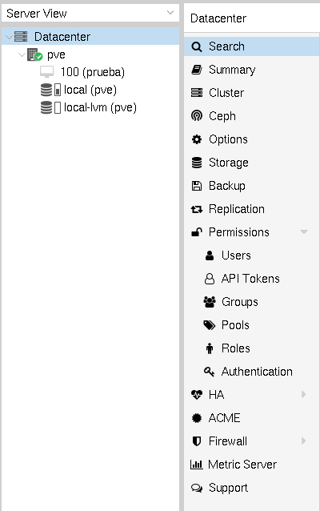

# Introducción al clúster Proxmox VE

Al instalar Proxmox VE se crea un clúster de servidores donde se van a
ejecutar las máquinas virtuales, se va administrar el
almacenamiento, ... Evidentemente, al hacer la primera instalación el
clúster solo tiene un servidor.

Por lo tanto, la estructura de nuestro clúster Proxmox VE está formada
por:

* *Datacenter*: Que representa el clúster. El Datacenter está formado
  por:
* *Nodos*: Representan a cada servidor que forma parte del clúster.

## Datacenter

Al elegir el **Datacenter** en la *Server View*, nos aparecen las
opciones del clúster en el panel lateral, veamos algunas de ellas:

* **Search**: Para realizar búsquedas en todo el clúster: nodos,
  máquinas virtuales, contenedores, almacenamiento, ...
* **Summary**: Ofrece una breve descripción general del estado del
  clúster y el uso de recursos.
* **Clúster**: Proporciona la funcionalidad y la información
  necesarias para crear o unirse a un clúster. Con un solo nodo
  todavía no tenemos la funcionalidad de clúster. No vamos a estudiarla en este curso.
* **Options**: Configuración general del clúster.
* **Storage**: Nos permite gestionar el almacenamiento del clúster.
* **Backup**: Nos proporciona la posibilidad de crear copias de
  seguridad de los recursos de nuestro clúster.
* **Replication**: Cuando tenemos más de dos nodos podemos administrar
  tareas de replicación de máquinas y contenedores en este apartado.
* **Permissions**: Podemos administrar usuarios, grupos, permisos,
  roles, ... a nivel del clúster.
* **HA**: Si tenemos más de un nodo podemos administrar los recursos
  que van a estar en alta disponibilidad.
* ...

## Nodos

Al elegir un determinado nodo del clúster, en la barra lateral nos
aparecen las opciones propias de ese nodo, veamos algunas de ellas:

* **Search**: Para realizar búsquedas en el nodo.
* **Summary**: Ofrece una breve descripción general del nodo y el uso de recursos en él.
* **Notes**: Podemos escribir comentarios usando Markdown.
* **Shell**: Nos permite acceder a la shell del nodo.
* **System**: Configura varios aspectos del nodo: red, DNS, certificados, resolución estática, logs, ...
* **Updates**: Nos permite gestionar los repositorios de paquetes y hacer actualizaciones del nodo.
* **Firewall**: Podemos configurar el cortafuego del nodo.
* **Disks**: Obtenemos información sobre los discos del nodo.
* ...

---

* [Vídeo: Introducción al clúster Proxmox VE](https://youtu.be/6hXuu00aWCo)
