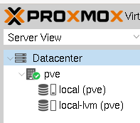
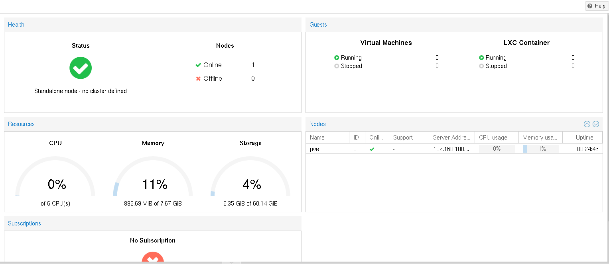

# Vista general de Proxmox VE

Una vez que hemos entrado en la interfaz gráfica de usuario nos
encontramos un panel de control que está dividido en cuatro partes:

## Cabecera

En la parte superior izquierda, lo primero que ve es el logotipo de
Proxmox. Junto a él se encuentra la versión actual de Proxmox VE. En
la barra de búsqueda cercana puede buscar objetos específicos (VM,
contenedores, nodos, ...). A veces, esto es más rápido que seleccionar
un objeto en el árbol de recursos.

A la derecha nos encontramos varios botones:

* **Documentation / Help**: nos muestran la documentación de Proxmox VE.
* **Create VM**: Crea el asistente para crear una máquina virtual.
* **Create CT**: Abra el asistente de creación de contenedores.
* **Usuario** identificado en la sesión: Nos permite modificar la
  configuración del usuario que ha accedido.

## Arbol de recursos

En esta zona encontramos los objetos disponibles. Los recursos lo
podemos ver con distintas vistas:

* **Server View**: Muestra todos los objetos, agrupados por nodos. Es
  la vista por defecto.
* **Folder View**: Muestra todos los objetos, agrupados por tipo.
* **Storage View**: Solo muestra los objetos de almacenamiento,
  agrupados por nodos.
* **Pool View**: Muestre máquinas virtuales y contenedores, agrupados
  por pools.

Si nos fijamos en la **Server View** podemos clasificar los objetos
que tenemos disponibles:

El objeto principal es el **Datacenter**, que representa el cluster
Proxmox VE que estamos gestionando. Está formado por:

* **Nodos**: Representa a cada servidor que forma parte del cluster.
* **Máquinas virtuales**.
* **Contenedores Linux**.
* **Almacenamiento**: Tenemos las distintas fuentes de almacenamiento
  que tenemos disponibles.
* **Pools**: Podemos agrupar los distintos objetos en pools para
  facilitar su gestión.

Cada una de las características de los objetos y sus distintas
configuraciones la veremos cuando estudiemos con profundidad cada una
de ellas.

## Panel central

En la parte central de la interfaz de usuario podremos visualizar
distintos aspectos del recurso o característica seleccionada.

## Panel de Log

En la parte inferior podemos visualizar las tareas y los logs de las
tareas que estamos realizando.

---

Para seguir profundizando:

* [Graphical User Interface](https://pve.proxmox.com/pve-docs/pve-admin-guide.html#chapter_gui)
