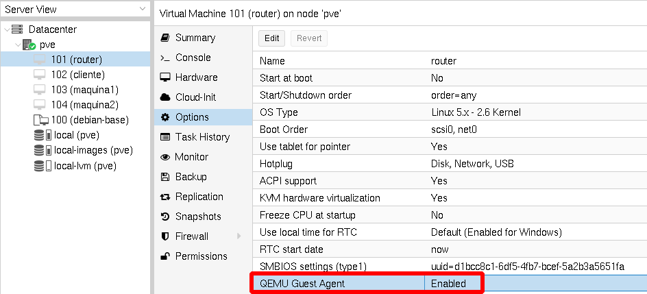
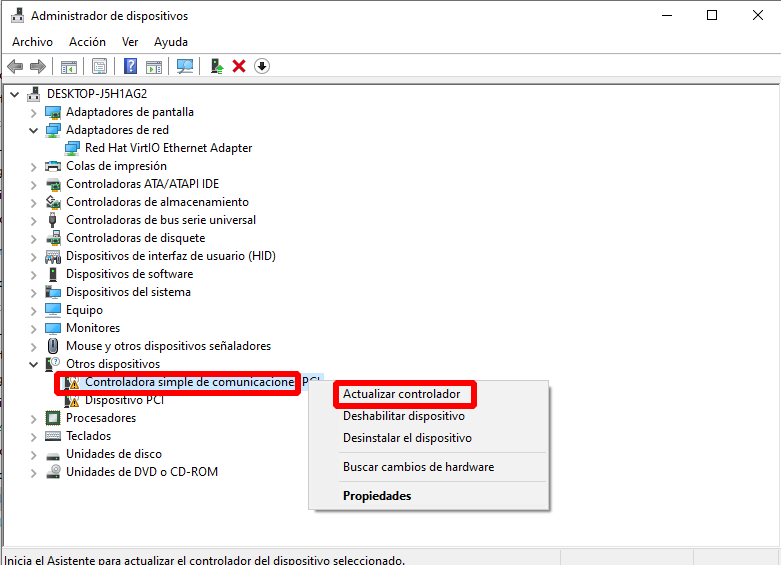
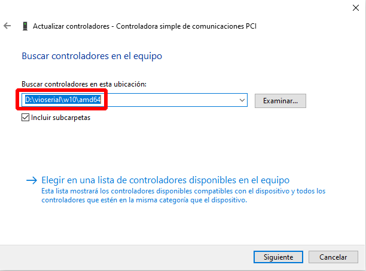
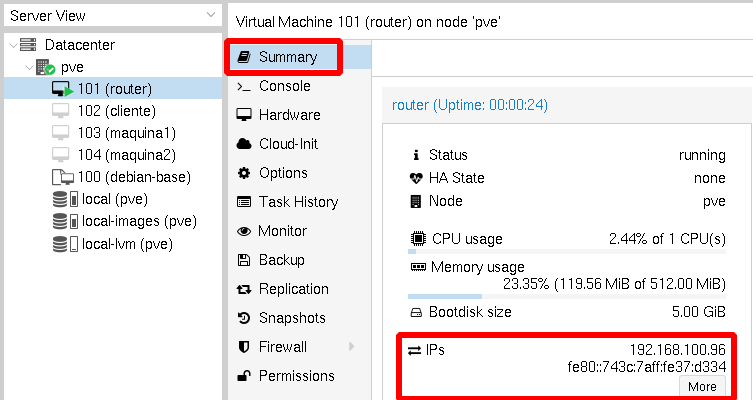

# Instalación de Qemu-guest-agent en las máquinas virtuales

El programa **Qemu-guest-agent** es un demonio que podemos instalar en las maquinas virtuales creadas en Proxmox que nos proporciona que haya una comunicación entre Proxmox y la máquina virtual. Esto nos puede permitir que la gestión del apagado de la máquina virtual sea más óptimo y tener información de la máquina, por ejemplo la ip que se ha configurado en sus interfaces de red.

## Configuración de Qemu-guest-agent

Para hacer uso de este programa debemos activarlo en la configuración de la máquina:

## Instalación de Qemu-guest-agent

Normalmente las máquinas Linux que creamos en Proxmox detectan que se están ejecutando en este entorno y durante la instalación instala este servicio (Por ejemplo en las máquinas Debian 11 se realiza la instalación automáticamente). Si n o se realiza la instalación de forma automática podemos instalar el paquete, por ejemplo en Debian/Ubuntu:

    apt install qemu-guest-agent

Para el sistema operativo Windows, desde el CDROM donde hemos montado los drivers VirtIO:

1. Vamos al **Administrador de Dispositivos** (**Device Manager**).
2. Buscamos **"PCI Simple Communications Controller"**
3. Botón derecho-> Actualizar Controlador (Update Driver) -> Seleccionar la iso montada en `DRIVE:\vioserial\<carpeta con el nombre de tu versión de windows>/amd64`.

A continuación instalamos el programa:

1. Con el explorador de ficheros nos posicionamos en la unidad del CDROM correspondiente a la ISO montada.
2. El instalador se encuentra en el directorio `guest-agent`.
3. Ejecutamos el instalador `qemu-ga-x86_64.msi` (64-bit).

## Prueba de funcionamiento

Podemos obtener información de la IP que se asignado a la máquina:

Para más información: [Qemu-guest-agent](https://pve.proxmox.com/wiki/Qemu-guest-agent)