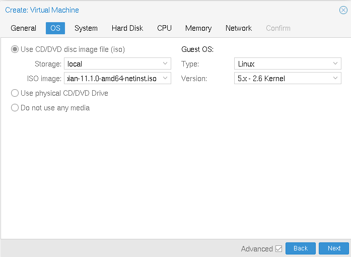
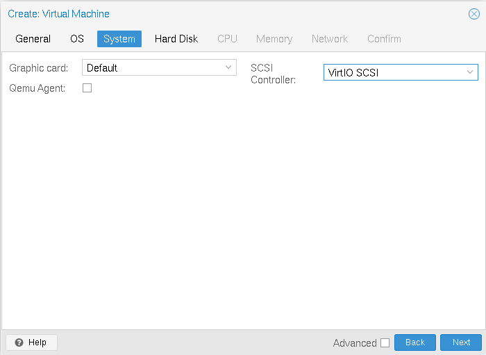
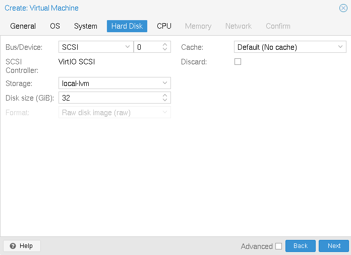
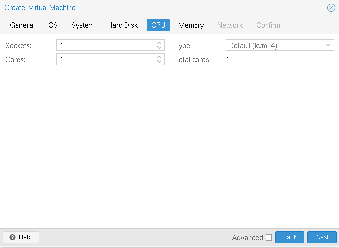
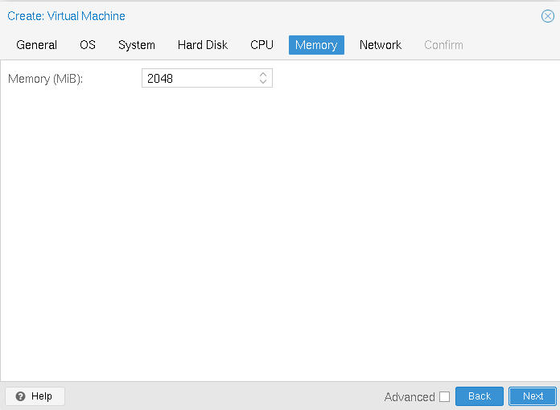
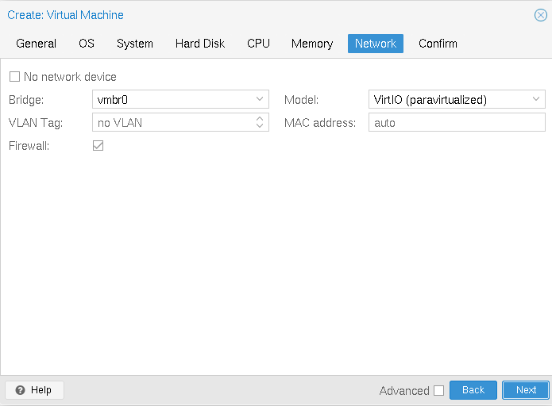
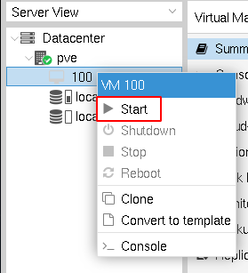

# Creación de máquinas virtuales Linux

Después de subir las imágenes ISO con las que vamos a trabajar, en este apartado vamos a explicar la creación de una máquina virtual con un sistema operativo linux. Sólo indicaremos las opciones más básicas para su creación, profundizando posteriormente en los próximos apartados.

Elegimos la opción de crear una máquina virtual:

Y seguimos los siguientes pasos:

### Identificar la máquina virtual

Indicamos el nodo donde se va a crear la máquina, su ID y su nombre.

### Elegimos el sistema operativo

Elegimos la ISO que vamos a utilizar para realizar la instalación. La ISO la escogeremos del medio de almacenamiento *local*. También seleccionamos el tipo de sistema operativo y la versión.

### Configuración del sistema

Elegimos la tarjeta gráfica y el controlador *VirtIO SCSI*, dejamos los valores por defecto.

### Selección del disco

En este apartado seleccionamos la configuración del disco raíz de la máquina que vamos a crear. Los valores de BUS/Device y Cache la dejamos por defecto. Por ahora sólo podemos escoger un medio de almacenamiento para almacenar el disco: *local-pve*, es decir. el disco d la máquina se guardará en un volumen lógico. También indicaremos el tamaño del disco.

### Selección de la CPU

Un zócalo (Socket) de CPU es una ranura física en la placa base de una PC donde puede conectar una CPU. Esta CPU puede contener uno o varios núcleos (Cores), que son unidades de procesamiento independientes. Podemos elegir el número de Sockets y Cores de la CPU de nuestra máquina. Además podemos emular distintos tipos de CPU, por el momento elegimos la opción por defecto.

### Configuración de la memoria

Indicamos la cantidad de memoria que tendrá nuestra máquina virtual.

### Configuración de red

En un principio nuestra máquina estará conectada al bridge externo `vmbr0` por lo que tomará una dirección IP del servidor DHCP de tu red local. No configuramos VLAN. El modelo de la tarjeta (*VirtIO*) y la dirección MAC lo dejamos con las opciones predeterminadas.

### Comienza la instalación

Se ha creado la máquina  virtual, la iniciamos:

Y desde la *Consola* podemos ver el monitor de la máquina para comenzar con la instalación:

