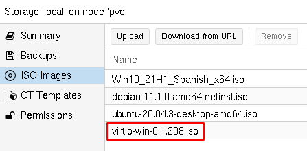
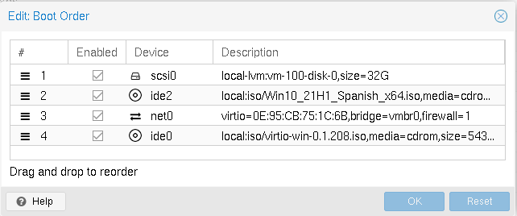
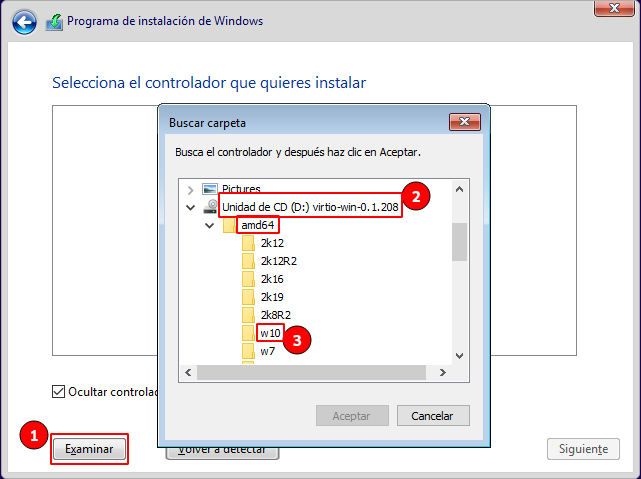
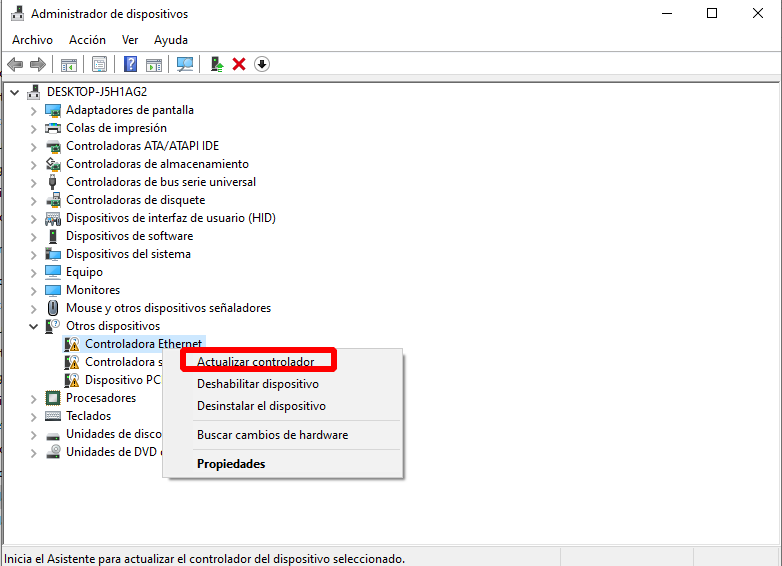
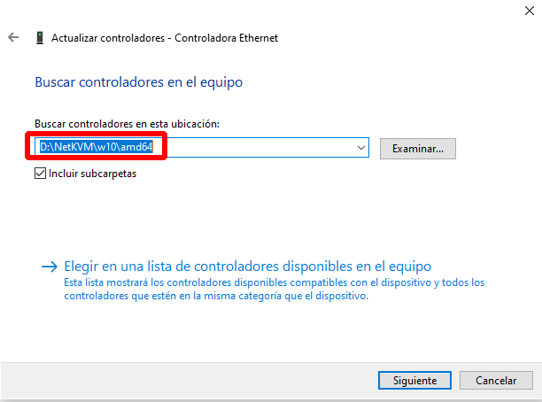

# Creación de máquinas virtuales Windows

En un apartado anterior hemos visto los pasos fundamentales para la
creación de una máquina virtual Linux. Para crear una máquina virtual
con un sistema operativo tipo Windows se siguen los mismos pasos, pero
tenemos que tener en cuenta que Windows no tiene soporte nativo para
dispositivos VirtIO. Por lo tanto, a la hora de crear una máquina
virtual Windows tendremos que añadir los controladores de dispositivos
(*drivers*) necesarios para que Windows identifique los dispositivos
VirtIO que definamos en la máquina virtual.

En este caso, el proyecto Fedora proporciona controladores de
dispositivos de software libre para VirtIO en Windows.

## ISO de los controladores de dispositivo VirtIO para Windows

Podemos bajar la última versión de los drivers VirtIO para Windows en
el siguiente
[enlace](https://fedorapeople.org/groups/virt/virtio-win/direct-downloads/stable-virtio/virtio-win.iso)
y subir la ISO a Proxmox VE.

## Creamos la nueva máquina virtual Windows

Teniendo en cuenta los siguiente:

* Elegimos una imagen ISO para instalar una versión de Windows.
* Al seleccionar el sistema operativo, elegimos como sistema operativo *Microsoft Windows* y la versión que vamos a instalar.
* Configuramos la CPU y la RAM para tener recursos suficientes.

Recuerda que escogemos como controlador de almacenamiento *VirtIO SCSI*:

## Añadimos un CDROM con los drivers VirtIO

Antes de iniciar la máquina, le añadimos un CD-ROM con la imagen ISO
de los drivers VirtIO.

Además, nos tenemos que asegurar que en el orden de arranque el CDROM
donde hemos montado la ISO de Windows (en mi caso ide2) esté por
delante que el CDROM con los drivers VirtIO.

## Comenzamos la instalación

Iniciamos la máquina, accedemos a la consola y comenzamos la
instalación, hasta que llegamos a la pantalla donde tenemos que
escoger el disco duro donde vamos a realizar la instalación.

Como vemos no se puede detectar el disco duro, ya que Windows no puede
reconocer inicialmente el controlador VirtIO. Vamos a cargar los
controladores de dispositivo VirtIO que necesitamos del CDROM que
hemos montado:

Elegimos la opción *Cargar contr.*, le damos a *Examinar* y elegimos
del CDROM donde tenemos los drivers VirtIO la carpeta de nuestra
arquitectura (*amd64*) y la versión de Windows.

Y ya podemos continuar con la instalación de Windows porque ya detecta
el disco duro:

## Configuración de la red

También podemos elegir VirtIO para la interfaz de red, ya que los
controladores de dispositivo VirtIO que hemos instalado también
incluyen el soporte para la red.

Una vez que hemos creado la máquina windows nos damos cuenta de que no tenemos conexión de red, debido a que Windows no tiene los drivers para el controlador VirtIO, para instalarlo:

1. Actualizamos el controlador del dispositivo **Controladora Ethernet** en el **Administrador de dispositivos**:

    

2. Y escogemos la carpeta del CDROM donde hemos montado los drivers VirtIO: `NetKVM\<carpeta con el nombre de tu versión de windows>\amd64`:

    

Para más información: [Windows VirtIO Drivers](https://pve.proxmox.com/wiki/Windows_VirtIO_Drivers).
