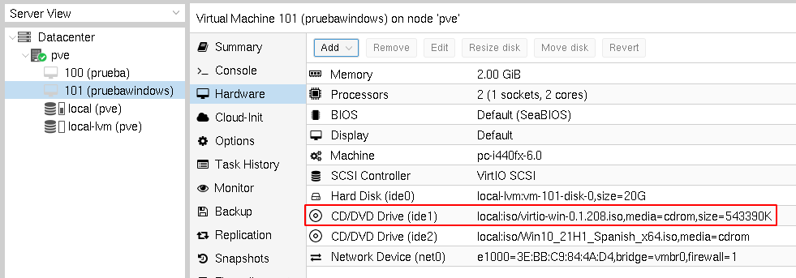

# Creación de máquinas virtuales Windows

En un apartado anterior hemos visto los pasos fundamentales para la creación de una máquina virtual Linux. Al seleccionar las características de la máquina hemos escogido controladores VirtIO (tanto para el disco duro como para la tarjeta de red), que son paravirtualizados por KVM (no emulados) y por lo tanto nos ofrecen mayor rendimiento (consulte [http://www.linux-kvm.org/page/Virtio](http://www.linux-kvm.org/page/Virtio)).

Windows no tiene soporte nativo para dispositivos VirtIO. Por lo tanto a la hora de crear una máquina virtual Windows tendremos que añadir los drivers necesarios para que Windows identifique el disco duro.

Los drivers que vamos a usar son de código abierto y los proporciona Red Hat. Se nos ofrecen los drivers para distintas versiones de Windows. 

Veamos entonces los pasos fundamentales para la creación de una máquina virtual Windows:

### Subimos la ISO de los driver VirtIO

Podemos bajar la última versión de los drivers VirtIO en el siguiente [enlace](https://fedorapeople.org/groups/virt/virtio-win/direct-downloads/stable-virtio/virtio-win.iso) y subir la ISO a Proxmox VE.

### Creamos la nueva máquina virtual

Teniendo en cuenta los siguiente:

* Elegimos una imagen ISO para instalar una versión de Windows.
* Al seleccionar el sistema operativo, elegimos como sistema operativo *Microsoft Windows* y la versión que vamos a instalar.
* Elegimos *Virtio Block* como tipo de disco duro.
* Configuramos la CPU y la RAM para tener recursos suficientes.

### Añadimos un CDROM con los drivers VirtIO

Antes de iniciar la máquina, le añadimos un CD-ROM con la imagen ISO de los drivers VirtIO.

Además nos tenemos que asegurar que en el orden de arranque el CDROM donde hemos montado la ISO de Windows (en mi caso ide2) este por delante que el CDROM con los drivers VirtIO.

### Comenzamos la instalación

Iniciamos la máquina, accedemos a la consola y comenzamos la instalación. 

