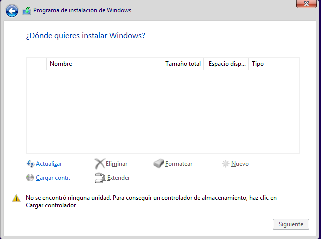
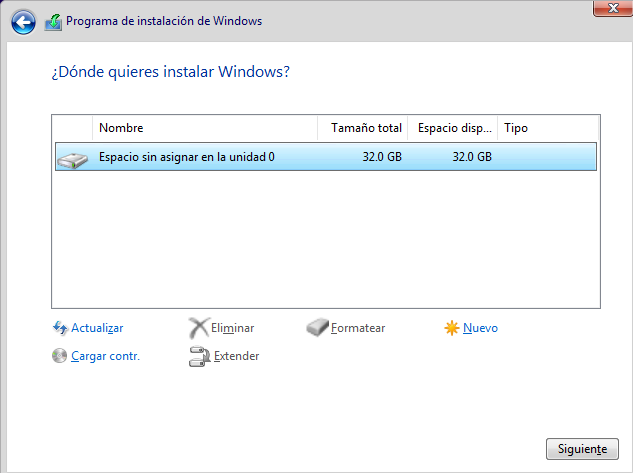

# Creación de máquinas virtuales Windows

En un apartado anterior hemos visto los pasos fundamentales para la creación de una máquina virtual Linux. Para crear una máquina virtual con el sistema operativo se siguen los mismos pasos, pero tenemos que tener en cuenta que Windows no tiene soporte nativo para dispositivos VirtIO. Por lo tanto a la hora de crear una máquina virtual Windows tendremos que añadir los drivers necesarios para que Windows identifique el disco duro.

Los drivers que vamos a usar son de código abierto y los proporciona Red Hat. Se nos ofrecen los drivers para distintas versiones de Windows. 

Veamos entonces los pasos fundamentales para la creación de una máquina virtual Windows:

### Subimos la ISO de los driver VirtIO

Podemos bajar la última versión de los drivers VirtIO en el siguiente [enlace](https://fedorapeople.org/groups/virt/virtio-win/direct-downloads/stable-virtio/virtio-win.iso) y subir la ISO a Proxmox VE.

### Creamos la nueva máquina virtual

Teniendo en cuenta los siguiente:

* Elegimos una imagen ISO para instalar una versión de Windows.
* Al seleccionar el sistema operativo, elegimos como sistema operativo *Microsoft Windows* y la versión que vamos a instalar.
* Configuramos la CPU y la RAM para tener recursos suficientes.

Recuerda que escogemos como controlador SCSI *VirtIO SCSI*:

### Añadimos un CDROM con los drivers VirtIO

Antes de iniciar la máquina, le añadimos un CD-ROM con la imagen ISO de los drivers VirtIO.

Además nos tenemos que asegurar que en el orden de arranque el CDROM donde hemos montado la ISO de Windows (en mi caso ide2) este por delante que el CDROM con los drivers VirtIO.

### Comenzamos la instalación

Iniciamos la máquina, accedemos a la consola y comenzamos la instalación, hasta que llegamos a la pantalla donde tenemos que escoger el disco duro donde vamos a realizar la instalación.

Como vemos no se puede detectar el disco duro, ya que Windows no tiene los drivers del controlador VirtIO. Vamos a cargar los drivers que necesitamos del CDROM que hemos montado:

Elegimos la opción *Cargar contr.*, le damos a *Examinar* y elegimos del CDROM donde tenemos los drivers VirtIO la carpeta de nuestra arquitectura (*amd64*) y la versión de Windows.

Y ya podemos continuar con la instalación de Windows poruqe ya hemos detectado el disco duro:

Para más información: [Windows VirtIO Drivers](https://pve.proxmox.com/wiki/Windows_VirtIO_Drivers).

