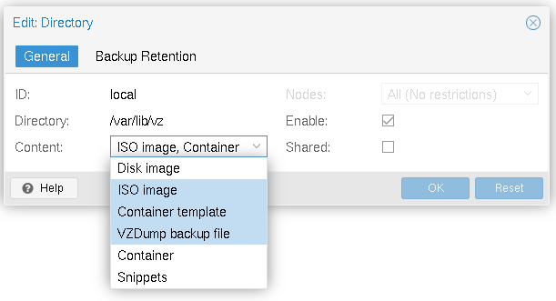
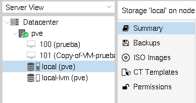
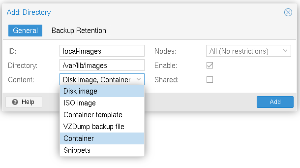
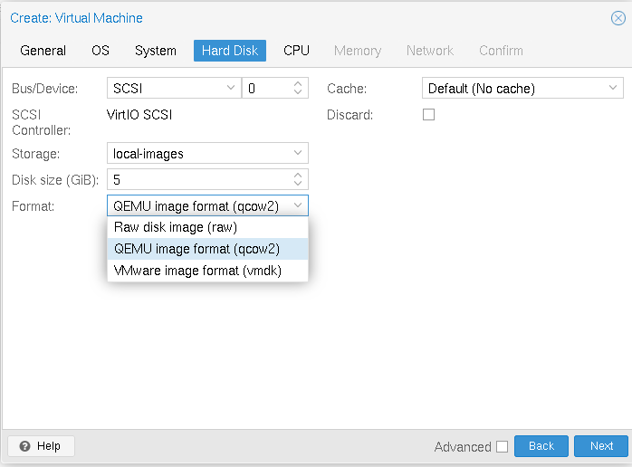

# Creación de una fuente de almacenamiento de tipo Directory

El almacenamiento de tipo **Directory** nos posibilita guardar información en un nodo del clúster Proxmox VE. Por lo tanto, no tenemos la funcionalidad de datos compartidos.

## Fuente de almacenamiento configurado por defecto


Como vimos anteriormente, al instalar Proxmox VE se nos crea una fuente de almacenamiento de tipo *Directory* llamado **local**. La información guardada en esta fuente se guarda en el directorio `/var/lib/vz` y por defecto está configurado para guardar en él lo siguiente:

* **ISO image**: Imágenes ISO.
* **Container template**: Plantillas de contenedores.
* **VZDump backup files**: Ficheros de copia de seguridad.



Si elegimos el almacenamiento **local**, podemos ver los datos que podemos guardar:



Si accedemos al nodo por ssh (o desde la terminal del panel de control, opción *Shell*), podemos comprobar la estructura de directorios que se ha creado:

```bash
ssh root@192.168.100.87
...
root@pve:~# cd /var/lib/vz
root@pve:/var/lib/vz# ls
dump  images  template
```

Por ejemplo, las imágenes ISO se guardan en:

```bash
root@pve:/var/lib/vz# cd template/iso/
root@pve:/var/lib/vz/template/iso# ls
debian-11.1.0-amd64-netinst.iso  ubuntu-20.04.3-desktop-amd64.iso  virtio-win-0.1.208.iso  Win10_21H1_Spanish_x64.iso
```

## Creación de una nueva fuente de almacenamiento de tipo Directory

Podríamos modificar la fuente de almacenamiento anterior y añadir dos nuevos tipos de informaciones que podría almacenar:

* **Disk image**: Imágenes de discos para las máquinas virtuales.
* **Containers**: Sistema de ficheros de los contenedores Linux.

Sin embargo, vamos a aprender a crear otra fuente de almacenamiento donde vamos a guardar las imágenes de disco de las máquinas virtuales y los datos del sistema de fichero de los contenedores.

Los discos de imágenes de las máquinas virtuales se pueden guardar en dos tipos de ficheros de imágenes:

* **raw**: El formato raw es una imagen binaria sencilla de la imagen del disco. Se ocupa todo el espacio que hayamos indicado al crearla. El acceso es más eficiente.
* **qcow2**: El formato QEMU copy-on-write. Al crearse sólo se ocupa el espacio que se está ocupando con los datos, el fichero irá creciendo cuando escribamos en él. Acepta snapshots y aprovisionamiento ligero. Es menos eficiente en cuanto al acceso. 
* **vmdk**: Un formato de archivo abierto, creado por VMware.

Para crear la nueva fuente, elegimos *Datacenter->Storage->Add->Directory*:


Indicamos un nombre, el directorio y el contenido que vamos a guardar, en nuestro caso: **Disk image** y **Containers**.



**Nota: El directorio `/var/lib/images` se crea automáticamente.**

## Creación de una máquina virtual usando la nueva fuente de almacenamiento

Ahora podemos crear máquinas virtuales cuyos discos virtuales se guarden en ficheros de imágenes que se guardarán en la fuente de almacenamiento **local-images**.

Durante el proceso de creación de la imagen, podremos elegir la fuente de almacenamiento donde vamos a guardar el disco, en nuestro caso elegimos la fuente **local-images**, y el tipo de fichero de imagen, nosotros vamos a elegir qcow2:



Hemos creado y configurado la máquina virtual con ID 101, si accedemos al nodo podemos ver donde se ha creado el fichero de imagen:

```bash
root@pve:/var/lib/images/images/101# ls
vm-101-disk-0.qcow2
```

**Nota: La fuente de almacenamiento de tipo *Directory* la hemos creado sobre el disco de la máquina donde tenemos instalado Proxmox VE, por lo tanto,  su capacidad será la que tiene este disco. En circunstancias reales, la fuente de tipo *Directory* la podríamos crear sobre un dispositivo de bloque (disco, raid, ...) añadido al nodo Proxmox VE.**

* [Vídeo: ](https://youtu.be/eXDjL2FJX_o)
