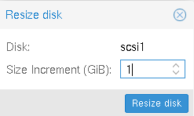
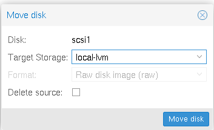
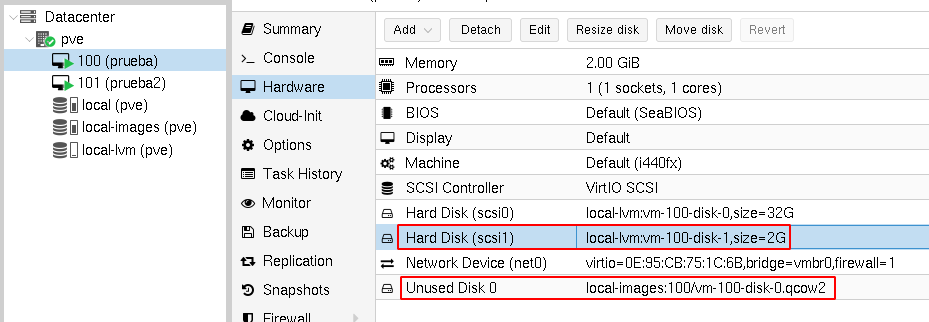

# Gestión de los discos de una máquina virtual

Si elegimos un disco en el apartado *Hardware* de una máquina virtual, observamos que tenemos varias operaciones que podemos realizar sobre él:


Veamos estas operaciones:

## Edit

Nos permite cambiar algunos parámetros del disco.

## Detach

Nos permite desconectar el disco de la máquina. El fichero de imagen o el volumen lógico no se borra, sino que aparece como disco no usado:


Un disco no usado    lo podemos borrar (opción *Remove*), o lo podemos editar (opción *Edit*). Si lo editamos y le damos a la opción *Add* lo volveremos conectar a la máquina:


## Resize disk

Podemos aumentar el tamaño de un disco con la opción *Resize disk*:



Recuerda que el aumento de tamaño del disco es independiente del aumento del sistema de ficheros, por lo tanto si accedemos a la máquina, podemos comprobar que el disco ahora es de 2Gb:

```bash
lsblk
NAME   MAJ:MIN RM  SIZE RO TYPE MOUNTPOINT
...
sdb      8:32   0    2G  0 disk 
```

Pero que el sistema de archivo sigue siendo de 1Gb:

```bash
root@debian:~# df -h
S.ficheros     Tamaño Usados  Disp Uso% Montado en
...
/dev/sdb         974M    24K  907M   1% /mnt
```

Como lo habiamos formateado con ext4, tenemos que ejecutar las siguientes instrucciones con el disco desmontado:

```bash
root@debian:~# umount /mnt 
root@debian:~# e2fsck -f /dev/sdb
root@debian:~# resize2fs /dev/sdb
root@debian:~# mount /dev/sdb /mnt
root@debian:~# df -h
S.ficheros     Tamaño Usados  Disp Uso% Montado en
...
/dev/sdb         2,0G   3,0M  1,9G   1% /mnt
```

Y comprobamos que hemos aumentado el tamaño del sistema de ficheros.

## Move disk

Podemos copiar el contendio de cualquier disco a otro pool de almacenamiento disponible. durante esta copiase puede indicar si se elimina el disco origen, o si se deja como disco no usado.

Nuestro disco adicional estaba guardado en un pool de tipo *Directory*, lo vamos a mover a un pool de tipo *Thin LVM*, por lo tanto la información guardada en un archivo de imagen qcow2, se va a guardar en un volumen LVM. El disco origen no lo vamos a borrar:



Comprobamos que ahora tenemos un disco guardado en el pool de almacenamiento **local-lvm** y un disco sin usar en el pool **local-images**.




