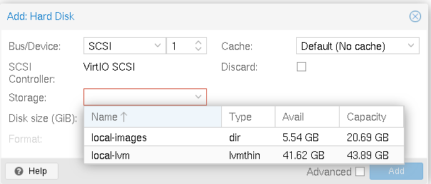

# Añadir nuevos discos a una máquina virtual

En el apartado *Hardware* de cualquier máquina virtual podemos añadirle nuevos discos duros:


Al añadir el nuevo disco, tendremos que elegir en que pool de almacenamiento se va a guardar su información y el tamaño del disco:



En nuestro caso, tenemos disponibles dos pools de almacenamiento:

* **local-images**: De tipo *Directory*, la información del disco se guardará en un fichero de imagen.
* **local-lvm**: De tipo `Thiin-LVM`, la información del disco se guardará en un volumen LVM.

En nuestro caso vamos a elegir la opción **local-images**, por lo que tendremos que elegir el tipo de fichero de imagen que vamos a usar:


Al añadir comprobamos que la máquina tiene dos discos:


## Formateo y uso del disco en la maquina virtual

Si accedemos a la máquina virtual (podemos hacerlo desde la terminal de Proxmox, opción `Shell` o accediendo a la máquina por ssh), podemos comprobar que tenemos un nuevo disco:

```bash
ssh jose@192.168.100.88
...
jose@debian:~$ sudo su -
root@debian:~# lsblk
NAME   MAJ:MIN RM  SIZE RO TYPE MOUNTPOINT
sda      8:0    0   32G  0 disk 
├─sda1   8:1    0   31G  0 part /
├─sda2   8:2    0    1K  0 part 
└─sda5   8:5    0  975M  0 part [SWAP]
sdb      8:16   0    1G  0 disk 
```

Podemos formatear el disco:

```bash
root@debian:~# mkfs.ext4 /dev/sdb
```

Y montar el disco para su utilización:

```bash
root@debian:~# mount /dev/sdb /mnt
```

Podemos ver las características del disco montado:

```bash
root@debian:~# df -h
S.ficheros     Tamaño Usados  Disp Uso% Montado en
udev             976M      0  976M   0% /dev
tmpfs            199M   436K  198M   1% /run
/dev/sda1         31G   1,1G   28G   4% /
tmpfs            992M      0  992M   0% /dev/shm
tmpfs            5,0M      0  5,0M   0% /run/lock
tmpfs            199M      0  199M   0% /run/user/1000
/dev/sdb         974M    24K  907M   1% /mnt
```


