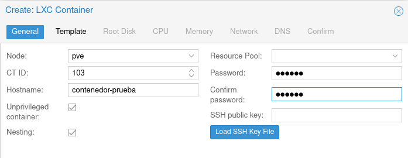

# Creación de contenedores Linux

Después de descargar las plantillas de contenedores con las que vamos a trabajar, estamos en disposición de crear un contenedor LXC. En este apartado vamos a explicar la creación de un contenedor LXC. Sólo indicaremos las opciones más básicas para su creación.

Elegimos la opción de crear un contenedor LXC:

Y seguimos los siguientes pasos:

## Identificar el contenedor LXC

Indicamos el nodo donde se va a crear el contenedor, su ID y su nombre. Además, tendremos que indicar la contraseña de acceso para el usuario `root` del contenedor o indicar nuestra clave ssh pública para el acceso al contenedor.

## Elegimos la plantilla 

Elegimos la plantilla desde la que vamos a crear el contenedor entre las que hemos descargado anteriormente. La plantilla se escogerá del medio de almacenamiento *local*. 

## Selección del disco

En este apartado seleccionamos la configuración del disco raíz del contenedor que vamos a crear. Elegimos el medio de almacenamiento para almacenar el disco, por ejemplo, *local-pve*, (en este caso el disco de la máquina se guardará en un volumen lógico). También indicaremos el tamaño del disco.

## Selección de la CPU

Seleccionamos el número de cores de vCPU que va a usar el contenedor.

## Configuración de la memoria

Indicamos la cantidad de memoria que tendrá nuestra máquina virtual (en MiB no MB (!)).

## Configuración de red

En un principio nuestra máquina estará conectada al bridge externo *vmbr0*  y la tarjeta de red se llamará *eth0*. Esta configuración se puede cambiar, y podríamos conectar nuestro contenedor a un bridge software definido por nosotros. Además, tendremos que decidir si la configuración de red será automática (DHCP) o manual, indicando la dirección (con formato IPv4/CIDR) y la puerta de enlace.

## Configuración DNS

En el último paso podemos configurar los servidores DNS que va a utilizar el contenedor o dejarlo sin rellenar, con lo que utilizará los DNS definido en el servidor Proxmox.

## Utilización del contenedor

Una vez que se ha creado el contenedor, podemos iniciarlo:

Y acceder a él por medio de la consola:

* [Vídeo: Creación de contenedores Linux](https://youtu.be/VkanQG31Cjk)
