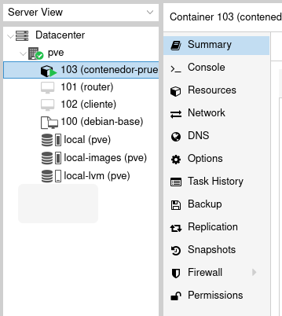
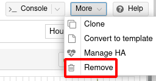

# Gestión de contenedores Linux

Las opciones para gestionar los contenedores LXC son similares a las que estudiamos para las máquinas virtuales.

## Botón derecho sobre el contenedor LXC

* **Start**: Iniciamos la ejecución del contenedor LXC.
* **Shutdown**: Se termina la ejecución del contenedor de forma
  ordenada.
* **Stop**: Se termina inmediatamente la ejecución del contenedor.
* **Reboot**: Reinicia la ejecución del contenedor.
* **Clone**: Nos permite clonar el contenedor.
* **Convert to template**: Nos permite crear una plantilla a partir de
  el contenedor para crear nuevas máquinas. 
* **Console**: Nos permite acceder a una consola para trabajar con la
  máquina.

## Panel lateral

Si elegimos un contenedor LXC, nos aparece un panel lateral con más opciones sobre el contenedor:

* **Sumary**: Resumen y monitorización del contenedor elegida.
* **Console**: Nos permite acceder a una consola para trabajar con el contenedor.
* **Resources**: Nos permite ver y cambiar la configuración de CPU y memoria.
* **Networks**: Nos permite gestionar las interfaces de red del contenedor.
* **DNS**: Nos permite configurar los servidores DNS que va a utilizar el contenedor.
* **Options**: Nos permite modificar opciones del contenedor.
* **Task History**: Nos muestra el historial de tareas que se han
  realizado sobre el contenedor.
* **Backup**: Nos permite realizar una copia de seguridad del contenedor.
* **Replication** Nos permite gestionar las réplicas del contenedor
  entre distintos nodos del cluster de Proxmox VE. 
* **Snapshot**: Nos permite crear un snapshot del contenedor para
  recuperar posteriormente su estado. 
* **Firewall**: Nos permite gestionar el cortafuego del contenedor.
* **Permisssions**: Nos permite especificar los distintos permisos que
  tienes los usuarios o grupos sobre el contenedor.

## Eliminar un contenedor LXC

Para eliminar un contenedor LXC tenemos tenemos que pararlo y escoger la opción
*Remove* del botón *More*:

Para eliminarla se nos pedirá el identificador del contenedor para la confirmación.