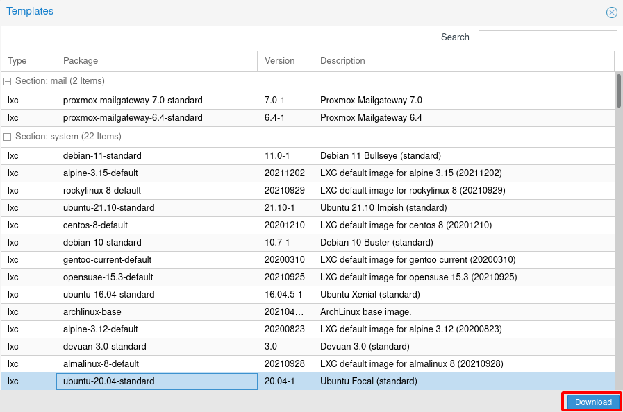
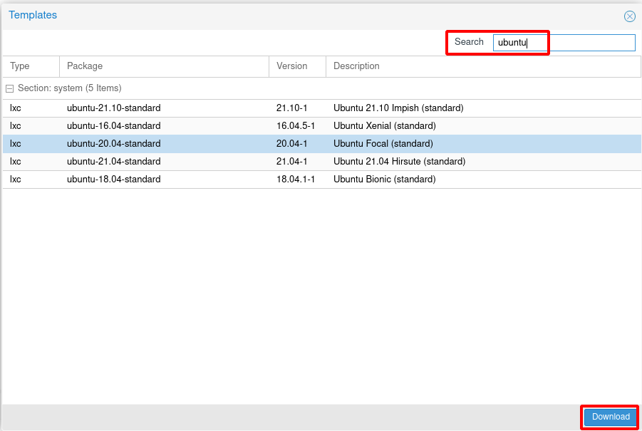
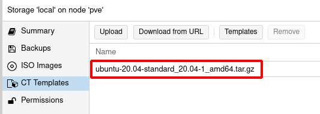

# Gestionando plantillas de contenedores

Los contenedores LXC se crean a partir de una **plantilla**. Un plantilla es el sistema de ficheros que va a utilizar el contenedor. Tendremos plantillas para las distintas distribuciones de Linux.

En Proxmox necesitamos descargar las plantillas que vamos a usar para la creación del contenedor LXC. Al crear un contenedor se clonará la plantilla para que el contenedor tenga su sistema de fichero. Este proceso se hace de manera muy rápida.

## Descargar plantillas en Proxmox

Como indicamos en unidades anteriores, en la fuente de almacenamiento **Local** podemos guardar, entre otras cosas, las **plantillas** que usaremos para crear los contenedores.

De esta forma, si accedemos al almacenamiento **Local**, y elegimos la opción **CT Templates** accedemos a la ventana que nos permite gestionar las plantillas.

Tenemos tres formas de obtener plantillas:

* **Upload**: Podemos subir una plantilla que tengamos en nuestro ordenador local.
* **Download from URL**: Podemos descargar una plantilla usando una URL.
* **Templates**: Proxmox nos ofrece un repositorio con un conjunto de plantillas que podemos descargar.

En este curso vamos a usar esta tercera opción. Podemos elegir, por ejemplo, el template de *Ubuntu-22.04-standard* y descargarlo con el botón **Download**.

Además tenemos un buscador que nos permite buscar por nombre:

Una vez descargada: 

Podemos comprobar que tenemos la plantilla disponible:

