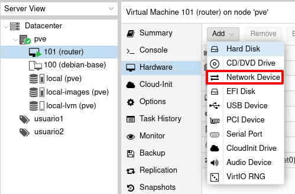
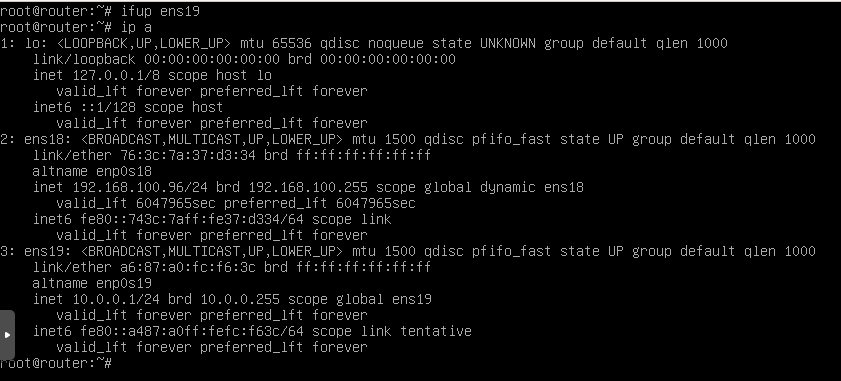

# Conexión de una máquina virtual a la red interna

Una vez tenemos creado nuestro bridge **vmbr1**, tenemos dos posibilidades:

* Conectarle una máquina que ya está funcionando. Es decir, añadir una interfaz de red a una máquina ya existente.
* Crear una nueva máquina conectada a este bridge.

Para explicar este apartado vamos a construir el siguiente esquema de red:

* La máquina *router* ya está creada y está conectada al bridge **vmbr0**, le vamos a añadir una interfaz conectada la bridge **vmbr1** y lo vamos a configurar con la ip `10.0.0.1`.
* La máquina *cliente* la vamos a crear conectada al bridge **vmbr1** con la dirección `10.0.0.2`.

## Añadir una nueva interfaz de red a una máquina

La máquina *router* ya está funcionando y tiene una interfaz de red conectada a **vmbr0**. Podemos añadirle una nueva interfaz de red desde el apartado **Hardware** de la máquina:

Elegimos al bridge al que va a estar conectada esta nueva interfaz (recuerda elegir el **driver VirtIO**):

En la red interna a la que hemos conectado la red no existe ningún servidor DHCP por lo que tendremos que hacer una configuración manual del direccionamiento de esta interfaz. La manera de hacer esta configuración dependerá del sistema operativo de la máquina que estamos configurando (en mi caso es una distribución Debian). Podemos comprobar que ya tenemos dos interfaces configuradas:

La nueva interfaz se llama `ens19` y es la que tenemos que configurar, para ello modificamos el fichero `/etc/network/interfaces` y añadimos el siguiente contenido:

Y para terminar la configuración levantamos la interfaz con `ifup` y comprobamos que ya tiene asignada la ip:

## Crear una nueva máquina virtual conectada a la red interna

La máquina *cliente* la vamos a crear conectada directamente al nuevo bridge. Para ello durante la configuración de la creación de la nueva máquina escogemos el nuevo bridge:

Una vez creada, comprobamos que esta máquina está conectada a **vmbr1**:

De la misma forma que hemos configurado la ip en la máquina *router*, vamos a configurar la ip de esta máquina. Vamos a configurar la ip `10.0.0.2`:

Y comprobamos que hay conectividad con la otra máquina:

## Conclusiones

La creación de diferentes Linux Bridge nos posibilita la construcción de escenarios complejos de red. Además tenemos que tener en cuenta que añadir o eliminar una interfaz de red se puede realizar en "caliente" sobre una máquina que esté funcionando. Del mismo modo, podemos modificar una interfaz de red ya existente para cambiar el bridge al que está conectada.