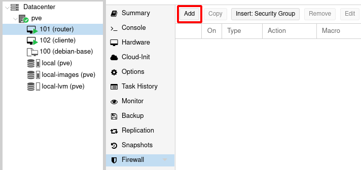

# Introducción al cortafuegos de Proxmox VE

La naturaleza de este curso no nos permite abarcar con profundidad aspectos relacionados con la seguridad de nuestro servidor Proxmox VE, pero sí podemos hacer una introducción al cortafuegos que nos ofrece el sistema para asegurar el acceso, tanto al servidor como a las máquinas virtuales y contenedores que gestionemos.

## Activación del cortafuego

El cortafuegos hay que activarlo a tres niveles:

### A nivel de Datacenter

Para activar el cortafuegos a nivel del clúster de servidores, tenemos que activar en la opción **Datacenter - Firewall - Options**:

En este nivel también puedes configurar:

* **Security Group**: Conjuntos de reglas de cortafuegos que posteriormente podemos asignar a un cortafuegos de una máquina.
* **Alias**: Nos permite nombrar direcciones IP para que sea más sencillo crear las reglas de cortafuegos.
* **IPSec**: Nos permite crear grupos de IP para facilitar la asignación de reglas de cortafuegos a varias IP. 

Estos elementos no lo vamos a usar en este curso.

### A nivel de Servidor

En este caso volvemos a activar el cortafuegos eligiendo el nombre del nodo, en mi caso la opción **pve - Firewall - Options**:

Al activar el cortafuegos a nivel del servidor, se utilizan las políticas de entrada y salida por defecto que se habían configurado en el nivel de Datacenter: todo el tráfico (de entrada y de salida bloqueado, pero se mantienen abierto el puerto 8006 (para acceder a la página web) y el 22 (para el acceso por ssh al servidor).

### Nivel de máquina/contenedor

Para activar el cortafuegos para una máquina/contenedor nos vamos a la opción **Firewall - Options** del recurso:

Vemos las políticas por defecto para esta máquina: 

* **Input policy: DROP**, es decir se deniega todo el tráfico de entrada (y tenemos que crear reglas de cortafuegos para permitir el tráfico que nos interese).
* **Output Policy: ACCEPT**, se acepta todo el tráfico de salida de la máquina (y tenemos que indicar las reglas de cortafuegos para denegar el tráfico que no permitamos).

Si quisiéramos un cortafuegos más restrictivo pondríamos las dos políticas por defecto a DROP, es decir, tanto el tráfico de entrada como el de salida estarían bloqueados, y tendríamos que ir creando reglas de cortafuegos para aceptar el tráfico que deseáramos permitir.

Además cómo una máquina o contenedor pueden tener más de una interfaz podemos activar o desactivar el cortafuegos para cada interfaz de red. Por defecto, el cortafuegos está activo en cada interfaz de red, para comprobarlo vemos las características hardware de las interfaces:

Podemos modificar las características del interfaz de red para desactivar el cortafuego.

**Resumen: Para poder habilitar el cortafuegos para una máquina virtual/contenedor, debemos habilitar el cortafuegos tanto a nivel de Datacenter como a nivel del servidor, finalmente podemos activar o desactivar el cortafuegos para cada una de las interfaces de red de una máquina o contenedor.**

## Creación de reglas de cortafuego

Como hemos visto anteriormente, si habilitamos el cortafuegos para una máquina tendrá permitido el tráfico hacia el exterior (**Output Policy: ACCEPT**) y tendrá denegado el tráfico desde el exterior a la máquina (**Input policy: DROP**).

Partimos de una máquina que tiene un servidor ssh instalado. Está máquina tendrá conectividad al exterior, pero no tendrá conectividad desde el exterior. Vamos a poner dos ejemplos de reglas:

### Regla para denegar que la máquina haga ping al exterior

Todo el tráfico esta permitido hacía el exterior pero vamos a denegar el ping. Para ello debemos crear una regla de salida para denegar el protocolo ICMP, para ello, a nivel de máquina virtual, vamos a añadir una regla al cortafuego, eligiendo la opción **Firewall - Add**:

Ahora creamos la regla de cortafuegos, indicando si es de entrada o salida (en nuestro caso dirección **out**), la acción **DROP**, si fuera necesaria podríamos poner la ip de origen y destino e indicamos el servicio que, en este caso, queremos denegar. En este ejemplo lo vamos a elegir directamente desde una lista de servicios que encontramos en el parámetro **Macro**. Por último, activamos esta regla. Quedaría del siguiente modo:

## Regla para permitir el acceso por ssh a la máquina

En esta ocasión tenemos que crear una regla que permita (acción **ACCEPT**) la entrada (dirección **in**) por el puerto de destino 22 del protocolo TCP. En esta ocasión no vamos a elegir el servicio de la lista de **Macro**, lo vamos a indicar directamente. Quedaría:

## Prueba de funcionamiento

Como podemos comprobar hemos creado dos reglas:

Podemos comprobar que aunque tiene permitido todo el acceso al exterior hemos bloqueado la posibilidad de que haga ping:

Y podemos comprobar que desde una máquina externa podemos acceder por ssh, aunque todo el tráfico desde el exterior estaba bloqueado:

---

Para seguir profundizando:

* [Firewall](https://pve.proxmox.com/wiki/Firewall)
* [Proxmox VE Firewall](https://pve.proxmox.com/pve-docs/pve-admin-guide.html#chapter_pve_firewall)