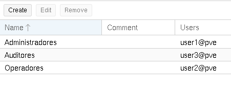

# Ejemplo 1: Especificar tipos de usuarios

En este primer ejemplo vamos a asignar diferentes roles a distintos grupos para que los distintos usuarios, según al grupo que pertenezcan, tengan unos permisos determinados. En este ejemplo no vamos a agrupar los recursos con **Pools de Recursos** por lo que todos los usuarios van a trabajar con los mismos recursos (fuentes de almacenamiento, máquinas virtuales y contenedores).

## Creación de grupos

Vamos a crear 3 grupos:

* **Administradores**: Los usuarios de este grupo están totalmente cualificados para gestionar ProxmoxVE, por lo que le vamos a asignar el rol `Administrator` para todos los objetos.
* **Operadores**: Los usuarios de este grupo sólo tienen la posibilidad de trabajar con fuentes de almacenamiento y gestionar máquinas virtuales. Pero no pueden modificar la configuración del sistema y del nodo de Proxmox VE. Así que le asignamos los roles `PVEDatastoreUser` y `PVEVMAdmin`.
* **Auditores**: Los usuarios de este grupo sólo tienen acceso a ver las máquinas virtuales. Se le asigna el rol de  `PVEAuditor`.

Creamos tres usuarios en cada uno de estos tres grupos:

Y asignamos los permisos:

## Prueba de funcionamiento

1. Puedes comprobar que al acceder con el `user1` (administrador) tienes todas las funcionalidades y posibilidades que tiene el usuario administrador `root`.
2. Al acceder con el `user2` (operador), comprobamos que aunque puede trabajar con fuentes de almacenamiento y máquinas virtuales, no puede acceder a la mayoría de las características del sistema Proxmox VE. Por ejemplo a nivel de **Datacenter**:
    
    

3. Finalmente si accedemos con el `user3` (auditor), observamos que sólo tenemos la posibilidad de ver información, por ejemplo el botón de crear máquinas virtuales o contenedores aparece deshabilitado:

    