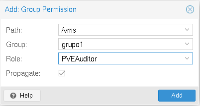

# Gestión de Permisos

Un **privilegio** es el derecho a realizar una acción específica. Para simplificar la gestión, las listas de privilegios se agrupan en **roles**, que luego pueden utilizarse en la **tabla de permisos**. Tenga en cuenta que los privilegios no pueden asignarse directamente a los usuarios y a las rutas sin formar parte de un rol.

## Privilegios

* Privilegios relacionados con el nodo/sistema:

    * `Permissions.Modify`: modificar los permisos de acceso.
    * `Sys.PowerMgmt`: gestión de la energía del nodo (arranque, parada, reinicio, apagado, ...).
    * `Sys.Console`: acceso a la consola del nodo.
    * `Sys.Syslog`: ver el syslog.
    * `Sys.Audit`: ver el estado/configuración del nodo, la configuración del clÚster.
    * `Sys.Modify`: crear/modificar/eliminar los parámetros de red del nodo.
    * `Group.Allocate`: crear/modificar/eliminar grupos.
    * `Pool.Allocate`: crear/modificar/eliminar un pool.
    * `Pool.Audit`: ver un pool.
    * `Realm.Allocate`: crear/modificar/eliminar fuentes de autentificación.
    * `Realm.AllocateUser`: asignar un usuario a un dominio.
    * `User.Modify`: crear/modificar/eliminar el acceso y los detalles del usuario.

* Privilegios relacionados con la máquina virtual:

    * `VM.Allocate`: crear/eliminar VM en un servidor.
    * `VM.Migrate`: migrar la VM a un servidor alternativo en el clúster.
    * `VM.PowerMgmt`: gestión de la energía (arranque, parada, reinicio, apagado, ...).
    * `VM.Console`: acceso a la consola de la VM.
    * `VM.Monitor`: acceso al monitor de la VM (kvm).
    * `VM.Backup`: copia de seguridad/restauración de VMs.
    * `VM.Audit`: ver la configuración de la VM.
    * `VM.Clone`: clonar/copiar una VM.
    * `VM.Config.Disc`: añadir/modificar/eliminar discos.
    * `VM.Config.CDROM`: expulsar/cambiar CD-ROM.
    * `VM.Config.CPU`: modificar la configuración de la CPU.
    * `VM.Config.Memory`: modificar la configuración de la memoria.
    * `VM.Config.Network`: añadir/modificar/eliminar dispositivos de red.
    * `VM.Config.HWType`: modificar los tipos de hardware emulados.
    * `VM.Config.Options`: modificar cualquier otra configuración de la VM.
    * `VM.Snapshot`: crear/borrar instantáneas de la VM.

* Privilegios relacionados con el almacenamiento:

    * `Datastore.Allocate`: crear/modificar/eliminar un pool de almacenamiento y eliminar volúmenes.
    * `Datastore.AllocateSpace`: asignar espacio en un pool de almacenamiento.
    * `Datastore.AllocateTemplate`: asignar/cargar plantillas e imágenes ISO.
    * `Datastore.Audit`: ver/examinar un pool de almacenamiento.

## Roles

Como se ha indicado los privilegios no se asignan directamente, los **roles** son conjuntos de privilegios que son los que se van a asignar para otorgar los permisos. Los roles predefinidos que tenemos los siguientes:

* `Administrador`: tiene todos los privilegios.
* `NoAccess`: no tiene privilegios (se utiliza para prohibir el acceso).
* `PVEAdmin`: puede realizar la mayoría de las tareas, pero no tiene derechos para modificar la configuración del sistema.
* `PVEAuditor`: sólo tiene acceso de lectura.
* `PVEDatastoreAdmin`: crea y asigna el espacio y las plantillas de las copias de seguridad.
* `PVEDatastoreUser`: asigna el espacio de copia de seguridad y ve el almacenamiento.
* `PVEPoolAdmin`: asigna pools de recursos.
* `PVEPoolUser`: ver o utilizar pools de recursos.
* `PVESysAdmin`: ACLs de usuario, auditoría, consola del sistema y registros del sistema.
* `PVETemplateUser`: ver y clonar plantillas.
* `PVEUserAdmin`: gestionar usuarios.
* `PVEVMAdmin`: administrar completamente las VMs.
* `PVEVMUser`: ver, hacer copias de seguridad, configurar el CD-ROM, la consola de la VM, la gestión de la energía de la VM.

Podemos crear nuevos roles para asignar nuevos perfiles de usuarios.

## Asignación de permisos

Los permisos (**roles**) se asignan a un **usuario o grupo** y a un **objeto** (máquina virtual/contenedor, pool de almacenamiento, grupo de recursos,...). Utilizamos rutas similares a las del sistema de archivos para indicar los objetos. Estas rutas forman un árbol y los permisos de niveles superiores (rutas más cortas) pueden propagarse opcionalmente hacia abajo dentro de esta jerarquía.

Ejemplo de rutas:

* `/vms`: Indica todas las máquinas virtuales
* `/vms/{vmid}`: Indica una máquina virtual con un id determinado.
* `/storage/{storeid}`: Indica un pool de almacenamiento con un id determinado.
* `/pool/{poolname}`: Indica un grupo de recursos con un nombre de terminado.
* ...

Como hemos indicado un permiso esta formado por una terna: Usuario/Grupo, Objeto/Ruta y Rol. Por ejemplo vamos a signar a los usuarios del *grupo1* permiso de auditor (`PVEAuditor`) para todas las máquinas virtuales.

Lo primero escogemos que vamos a asignar un permiso a un grupo:

A continuación indicamos el objeto/ruta, el grupo y el rol:

Y podemos ir viendo los permisos que estamos asignando:

## Permisos y redes

Como has podido comprobar no tenemos ningún conjunto de privilegios que nos permita especificar los permisos sobre las redes internas que hemos creado y sobre los bridge linux que se han creado.

Es más, sólo puede crear nuevos Linux Bridge, que nos posibilitan la opción de conectar nuestros recursos virtualizados a redes internas, el usuario `root`. Además también observamos que no podemos agrupar en un Pool de Recursos los Linux Bridge creados. Esto implica que cualquier usuario que acceda puede usar cualquier Linux Bridge creado.

Aunque se están desarrollando, en las nuevas versiones de desarrollo de Proxmox, la posibilidad de que las redes sean otro recurso al que podemos asignar distintos permisos, en la versión actual no podemos asignar a los bridge creados ningún tipo de permiso. Esto puede ser una limitación desde el punto de vista de la utilización de Proxmox con los alumnos, ya que no se podría asegurar que un alumno use exclusivamente un bridge creado por el administrador.
