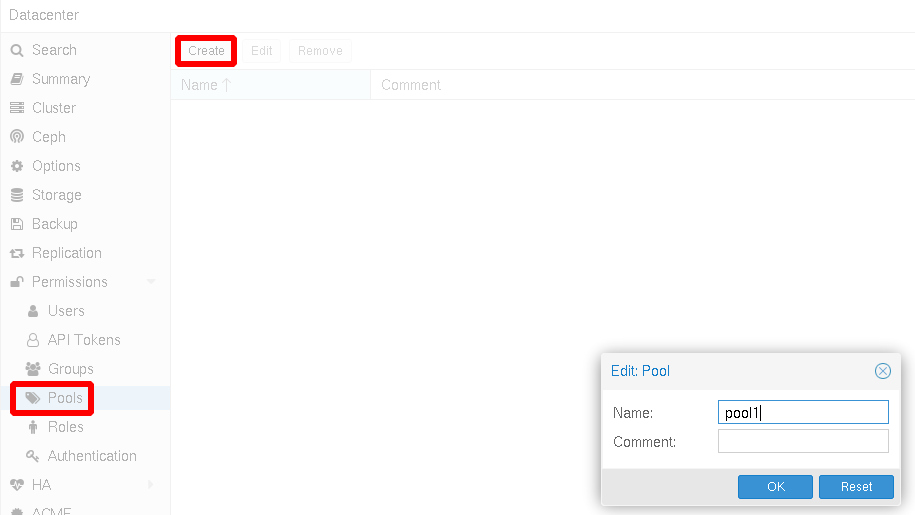

# Gestión de Pools de Recursos

Un grupo (o pool) de recursos es un conjunto de máquinas virtuales, contenedores y pools de almacenamiento. La podemos usar simplemente para agrupar recursos o para asignarles permisos.

## Creación de un Pool de Recursos

Para crear un un pool de recursos solamente es necesario indicar su nombre y opcionalmente un comentario:

Un pool se pueden editar (para cambiar el comentario) y eliminar (un pool sólo se puede eliminar cuando no tiene ningún recurso asignado).

## Asignación de recursos a un pool

Para gestionar los Pools de recursos es aconsejable usar la vista de pools (*Pool View*). Escogemos el pool y en el apartado *Members* podemos añadir los medios de almacenamiento y las máquinas virtuales o contenedores que van a a pertenecer a este pool.

Deberemos añadir los medios de almacenamientos que usan las máquinas virtuales o contenedores que van a formar parte del pool. 

En este ejemplo hemos incluido todos los medios de almacenamiento y una máquina virtual:

Una máquina virtual sólo puede pertenecer a un pool en un determinado momento.

Al crear una máquina virtual o un contenedor podemos indicar al pool de recursos que va a pertenecer:

De la misma forma al clonar una máquina o contenedor, también podemos indicar eel pool al que va a pertenecer:

